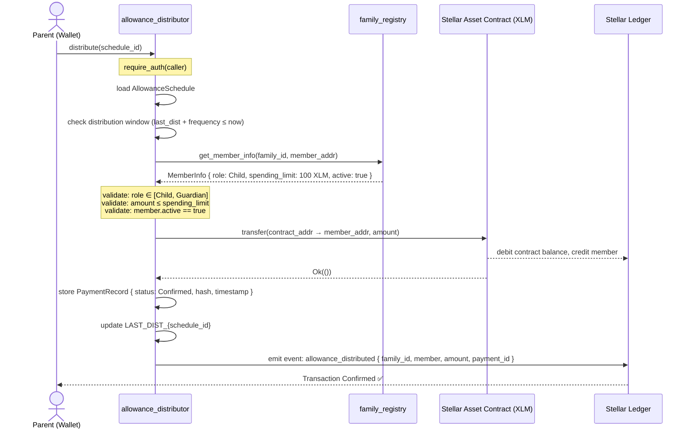
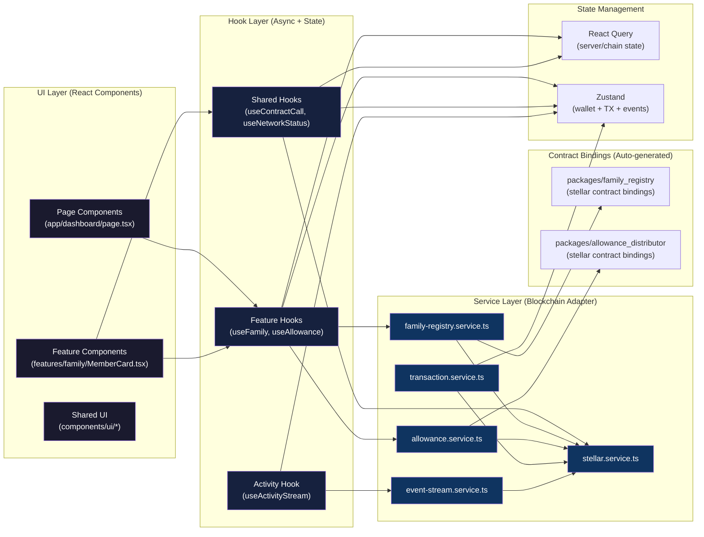
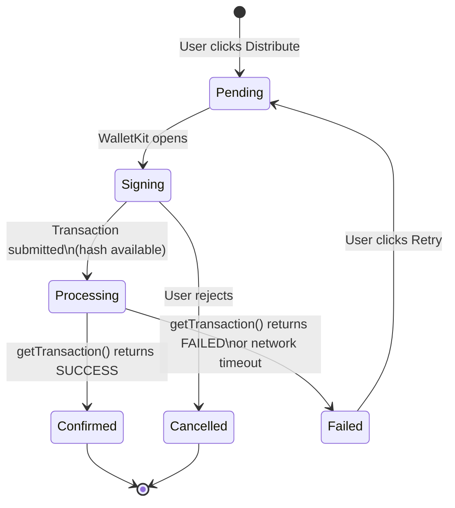
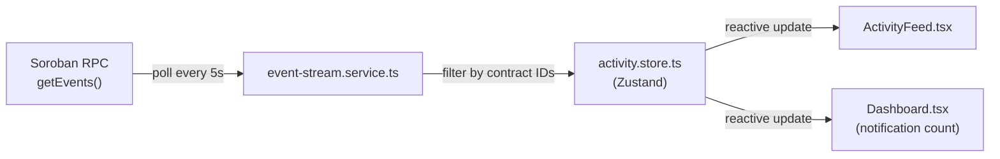
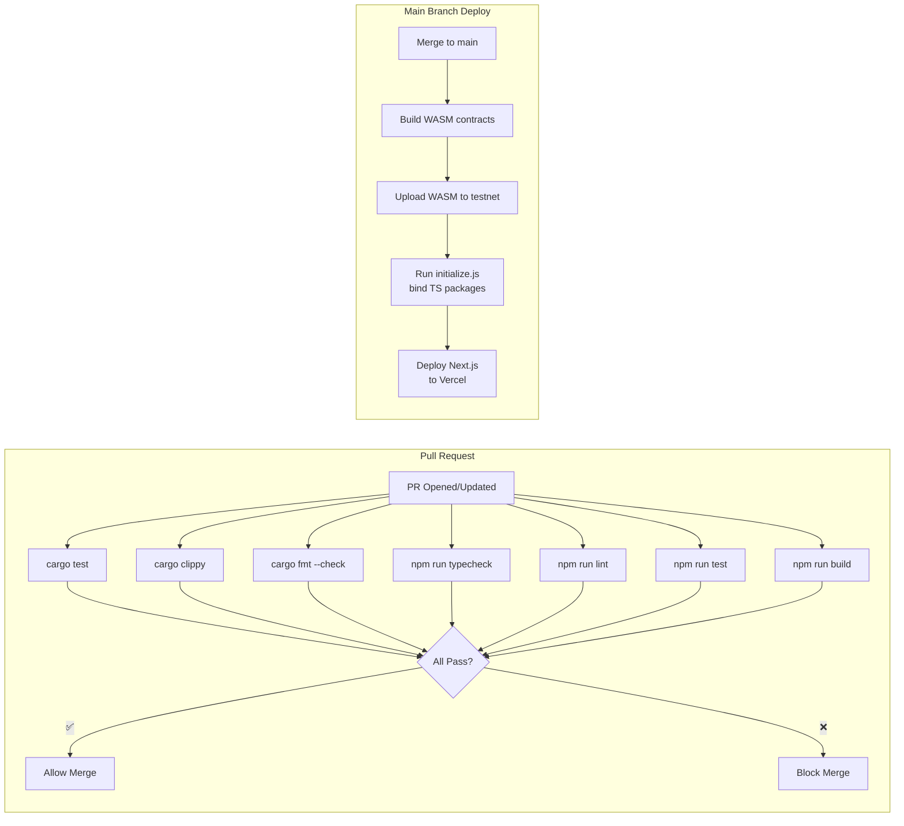

# 🌟 Family Allowance Manager

> **A production-ready, decentralized family financial management platform built on the Stellar blockchain.**
> Automate recurring allowance payments, enforce spending rules, and maintain tamper-proof financial records — powered by Soroban smart contracts.

[](./LICENSE)
[](https://stellar.org)
[](https://developers.stellar.org/docs/build/smart-contracts)
[](https://nextjs.org)
[](https://www.typescriptlang.org)
[](#testing)

---

## 📋 Table of Contents

1. [Product Overview](#-product-overview)
2. [Problem Statement](#-problem-statement)
3. [Key Features](#-key-features)
4. [Tech Stack](#-tech-stack)
5. [Architecture Diagram](#-architecture-diagram)
6. [Smart Contract Design](#-smart-contract-design)
7. [Inter-Contract Communication](#-inter-contract-communication)
8. [Frontend Architecture](#-frontend-architecture)
9. [Local Development](#-local-development)
10. [Environment Variables](#-environment-variables)
11. [Testing](#-testing)
12. [CI/CD Pipeline](#-cicd-pipeline)
13. [Deployment](#-deployment)
14. [Security Considerations](#-security-considerations)
15. [Contract Addresses](#-contract-addresses)
16. [Screenshots](#-screenshots)
17. [Demo](#-demo)
18. [Contributing](#-contributing)
19. [License](#-license)

---

## 🌟 Product Overview

Family Allowance Manager is a decentralized financial management platform that enables parents and guardians to **securely distribute allowances to family members** while maintaining full transparency, accountability, and automation on the Stellar blockchain.

Instead of manually transferring money and tracking spending in spreadsheets, the platform uses **Soroban smart contracts** to:

- **Automate** recurring allowance payments on a daily, weekly, or monthly schedule
- **Enforce** spending limits and savings goals on-chain
- **Record** every transaction immutably on the blockchain
- **Notify** parents whenever funds are released or rules are triggered

Every allowance transfer is a verifiable on-chain event — no bank intermediaries, no manual reconciliation, no trust-me-bro accounting.

---

## 🎯 Problem Statement

Managing family allowances today is fragmented, manual, and opaque:

| Problem | Impact |
|---------|--------|
| Manual transfers via bank/Venmo/cash | Forgotten payments, inconsistent schedules |
| No on-chain record | No auditable history for teaching financial responsibility |
| No programmable rules | Parents can't enforce savings goals or spending limits automatically |
| Trust issues | Children can't independently verify payment history |
| No automation | Parents must manually release funds every week |

**Family Allowance Manager solves all of this** by moving allowance management onto a public, permissionless, programmable blockchain — where the rules are in the contract, not in someone's head.

---

## ✨ Key Features

### For Parents / Guardians
- 🏠 **Family Group Creation** — Create a family group and invite members by Stellar wallet address
- 👥 **Role-Based Access Control** — Assign `Parent`, `Guardian`, or `Child` roles with on-chain enforcement
- 📅 **Automated Schedules** — Configure daily, weekly, or monthly allowance payments
- 💰 **Spending Limits** — Set hard on-chain limits that cannot be bypassed
- 🏦 **Savings Goals** — Define savings targets per member, tracked transparently
- 🔔 **Activity Feed** — Real-time feed of every on-chain event from your family group
- 📊 **Analytics Dashboard** — Visualize payment history, spending trends, and goal progress

### For Children / Dependents
- 💳 **Wallet Balance** — View real-time XLM balance via Stellar wallet
- 📜 **Payment History** — Immutable, tamper-proof record of every received allowance
- 🎯 **Savings Progress** — Track savings goal progress on-chain

### Platform Features
- 🔗 **Multi-wallet Support** — Freighter, xBull, Lobstr, Hana via StellarWalletsKit
- ⛓️ **Transaction Center** — Full lifecycle tracking: Pending → Processing → Confirmed / Failed
- 🔄 **Retry & Recovery** — Failed transactions can be retried with one click
- 🤖 **Cron Bot** — Off-chain automation script for hands-free scheduled distributions
- 📱 **Mobile Responsive** — Full-featured on desktop and mobile

---

## 🛠️ Tech Stack

### Smart Contracts
| Layer | Technology |
|-------|------------|
| Language | Rust |
| Platform | Soroban (Stellar) |
| SDK | `soroban-sdk` |
| Testing | Soroban test harness (native) |
| CLI | `stellar` CLI |
| Token | Native XLM via Stellar Asset Contract (SAC) |

### Frontend
| Layer | Technology |
|-------|------------|
| Framework | Next.js 15 (App Router) |
| Language | TypeScript 5.x |
| Styling | Tailwind CSS v3 + shadcn/ui |
| State (server) | TanStack React Query v5 |
| State (client) | Zustand v4 |
| Wallet | StellarWalletsKit |
| Charts | Recharts |
| Testing | Vitest + React Testing Library |

### Infrastructure
| Layer | Technology |
|-------|------------|
| CI/CD | GitHub Actions |
| Hosting | Vercel (Next.js) |
| Testnet RPC | SDF Soroban Testnet |
| Explorer | stellar.expert |
| Monitoring | Sentry (abstracted) |

---

## 🏗️ Architecture Diagram

```mermaid
graph TB
    subgraph "👤 Users"
        P["👨‍👩‍👧 Parent / Guardian"]
        C["👦 Child / Dependent"]
    end

    subgraph "🌐 Frontend — Next.js 15"
        LP["Landing Page"]
        DB["Dashboard"]
        AF["Activity Feed\n(Real-time Events)"]
        TC["Transaction Center\n(Pending/Processing/Confirmed/Failed)"]
        AN["Analytics"]
        ST["Settings"]
        WK["StellarWalletsKit\n(Freighter, xBull, Lobstr, Hana)"]
    end

    subgraph "🔧 Service Layer"
        SS["stellar.service.ts"]
        FRS["family-registry.service.ts"]
        AS["allowance.service.ts"]
        TS["transaction.service.ts"]
        ES["event-stream.service.ts"]
    end

    subgraph "📦 State Management"
        ZW["wallet.store\n(Zustand)"]
        ZF["family.store\n(Zustand)"]
        ZT["tx.store\n(Zustand)"]
        ZA["activity.store\n(Zustand)"]
        RQ["React Query Cache\n(chain reads)"]
    end

    subgraph "⛓️ Stellar Testnet"
        RPC["Soroban RPC\nsoroban-testnet.stellar.org"]
        HZ["Horizon API\nhorizon-testnet.stellar.org"]

        subgraph "📋 Soroban Contracts"
            FR["family_registry\nContract\n(RBAC + Groups)"]
            AD["allowance_distributor\nContract\n(Payments + Schedules)"]
        end

        SAC["Stellar Asset Contract\n(Native XLM)"]
        LEDGER["Stellar Ledger\n(Immutable History)"]
    end

    subgraph "🤖 Off-chain Bot"
        BOT["distribution-bot.js\n(Node.js Cron Script)"]
    end

    P -->|connect wallet| WK
    C -->|connect wallet| WK
    WK -->|sign transactions| SS
    SS -->|submit InvokeHostFunctionOp| RPC

    LP & DB & AF & TC & AN & ST --> FRS & AS & TS & ES
    FRS --> SS
    AS --> SS
    TS --> SS
    ES -->|poll getEvents every 5s| RPC

    SS --> ZW & ZT
    FRS --> RQ
    AS --> RQ
    ES --> ZA

    RPC --> FR & AD
    AD -->|cross-contract call\nget_member_info()| FR
    AD -->|SAC::transfer()| SAC
    SAC -->|debit/credit XLM| LEDGER
    FR -->|emit events| LEDGER
    AD -->|emit events| LEDGER

    BOT -->|invoke distribute()| RPC
    HZ -->|account balances| SS
```

---

## 📜 Smart Contract Design

The platform uses **two Soroban smart contracts** that communicate with each other and with the Stellar Asset Contract (SAC).

### Contract 1: `family_registry`

**Purpose:** Acts as the authoritative registry for families, members, roles, and financial rules.

```
family_registry/
├── lib.rs          — Contract entry point, public function signatures
├── types.rs        — FamilyGroup, MemberInfo, Role, ScheduleFrequency
├── storage.rs      — Type-safe storage key helpers (Instance/Persistent/Temporary)
├── events.rs       — Typed event emission (family_created, member_added, ...)
├── access.rs       — RBAC macros: require_role!(Parent | Guardian)
└── errors.rs       — ContractError enum with descriptive codes
```

**Public interface:**
```rust
// Initialization
fn initialize(env: Env, admin: Address) -> Result<(), ContractError>
fn upgrade(env: Env, new_wasm_hash: BytesN<32>) -> Result<(), ContractError>

// Family management
fn create_family(env: Env, caller: Address, name: String) -> Result<u32, ContractError>
fn get_family(env: Env, family_id: u32) -> Result<FamilyGroup, ContractError>
fn archive_family(env: Env, caller: Address, family_id: u32) -> Result<(), ContractError>

// Member management
fn add_member(env: Env, caller: Address, family_id: u32, member: Address, role: Role) -> Result<(), ContractError>
fn remove_member(env: Env, caller: Address, family_id: u32, member: Address) -> Result<(), ContractError>
fn get_member_info(env: Env, family_id: u32, member: Address) -> Result<MemberInfo, ContractError>
fn update_member_limits(env: Env, caller: Address, family_id: u32, member: Address, spending_limit: i128, savings_goal: i128) -> Result<(), ContractError>
fn change_member_role(env: Env, caller: Address, family_id: u32, member: Address, new_role: Role) -> Result<(), ContractError>

// Queries
fn get_family_members(env: Env, family_id: u32) -> Result<Vec<Address>, ContractError>
fn is_member(env: Env, family_id: u32, member: Address) -> bool
```

**Storage tiers:**
| Key Pattern | Data | Storage Tier | TTL |
|-------------|------|-------------|-----|
| `ADMIN` | `Address` | Instance | Contract lifetime |
| `FAMILY_COUNT` | `u32` | Instance | Contract lifetime |
| `FAMILY_{id}` | `FamilyGroup` | Persistent | Extended (bump 1yr) |
| `MEMBER_{family}_{addr}` | `MemberInfo` | Persistent | Extended (bump 1yr) |
| `MEMBERS_{family}` | `Vec<Address>` | Persistent | Extended (bump 1yr) |

---

### Contract 2: `allowance_distributor`

**Purpose:** Manages allowance schedules, executes distributions (with cross-contract role validation), records payments, and emits events.

```
allowance_distributor/
├── lib.rs                  — Contract entry point
├── types.rs                — AllowanceSchedule, PaymentRecord, PaymentStatus, ScheduleFrequency
├── storage.rs              — Storage key helpers
├── events.rs               — allowance_scheduled, allowance_distributed, payment_failed
├── errors.rs               — ContractError enum
└── registry_interface.rs   — Client stub for calling family_registry cross-contract
```

**Public interface:**
```rust
// Initialization
fn initialize(env: Env, admin: Address, registry_contract: Address, token_contract: Address) -> Result<(), ContractError>
fn upgrade(env: Env, new_wasm_hash: BytesN<32>) -> Result<(), ContractError>

// Schedule management
fn create_schedule(env: Env, caller: Address, family_id: u32, member: Address, amount: i128, frequency: ScheduleFrequency, start_ledger: u32) -> Result<u32, ContractError>
fn update_schedule(env: Env, caller: Address, schedule_id: u32, amount: i128, frequency: ScheduleFrequency) -> Result<(), ContractError>
fn cancel_schedule(env: Env, caller: Address, schedule_id: u32) -> Result<(), ContractError>
fn get_schedule(env: Env, schedule_id: u32) -> Result<AllowanceSchedule, ContractError>
fn get_family_schedules(env: Env, family_id: u32) -> Result<Vec<AllowanceSchedule>, ContractError>

// Distribution
fn distribute(env: Env, caller: Address, schedule_id: u32) -> Result<u32, ContractError>  // returns payment_id
fn distribute_all_due(env: Env, caller: Address, family_id: u32) -> Result<Vec<u32>, ContractError>  // batch

// Payment records
fn get_payment(env: Env, payment_id: u32) -> Result<PaymentRecord, ContractError>
fn get_member_payments(env: Env, family_id: u32, member: Address, limit: u32) -> Result<Vec<PaymentRecord>, ContractError>
fn get_family_payments(env: Env, family_id: u32, limit: u32) -> Result<Vec<PaymentRecord>, ContractError>
```

**Storage tiers:**
| Key Pattern | Data | Storage Tier |
|-------------|------|-------------|
| `ADMIN` | `Address` | Instance |
| `REGISTRY` | `Address` | Instance |
| `TOKEN` | `Address` | Instance |
| `SCHEDULE_COUNT` | `u32` | Instance |
| `PAYMENT_COUNT` | `u32` | Instance |
| `SCHEDULE_{id}` | `AllowanceSchedule` | Persistent |
| `FAMILY_SCHEDULES_{id}` | `Vec<u32>` | Persistent |
| `PAYMENT_{id}` | `PaymentRecord` | Persistent |
| `MEMBER_PAYMENTS_{family}_{addr}` | `Vec<u32>` | Persistent |
| `LAST_DIST_{schedule_id}` | `u64` (timestamp) | Persistent |

---

## 🔄 Inter-Contract Communication

The `allowance_distributor` makes **two types of cross-contract calls** on every distribution:



**Cross-contract call implementation (Rust):**
```rust
// In allowance_distributor/src/registry_interface.rs
soroban_sdk::contractimport!(
    file = "../../family_registry/target/wasm32v1-none/release/family_registry.wasm"
);

// In lib.rs — during distribute()
let registry = Client::new(&env, &registry_addr);
let member_info = registry.get_member_info(&family_id, &member_addr);

if !member_info.active {
    return Err(ContractError::MemberInactive);
}
if amount > member_info.spending_limit {
    return Err(ContractError::ExceedsSpendingLimit);
}
```

---

## 🖥️ Frontend Architecture

The frontend enforces **strict layer separation** — no blockchain logic ever lives in a React component.



### Transaction Lifecycle State Machine



### Real-time Event Stream



---

## 💻 Local Development

### Prerequisites

```bash
# Rust (stable + wasm32 target)
curl --proto '=https' --tlsv1.2 -sSf https://sh.rustup.rs | sh
rustup target add wasm32v1-none

# Stellar CLI
cargo install --locked stellar-cli --features opt

# Node.js 20+ and npm
node --version  # must be 20+

# Docker (for local Stellar node)
docker --version
```

### 1. Clone and Install

```bash
git clone https://github.com/YOUR_USERNAME/family-allowance-manager2.git
cd family-allowance-manager2

# Install frontend dependencies
cd frontend
npm install
cd ..
```

### 2. Start Local Stellar Node

```bash
docker run --rm -it \
  -p 8000:8000 \
  --name stellar-local \
  stellar/quickstart:latest \
  --local --enable-soroban-rpc
```

### 3. Build and Deploy Contracts (Local)

```bash
# Build all contracts
cd contracts
stellar contract build
cd ..

# Deploy locally and generate TypeScript bindings
node scripts/initialize.js
```

### 4. Configure Environment

```bash
cp .env.example frontend/.env.local
# Edit frontend/.env.local — set NEXT_PUBLIC_STELLAR_NETWORK=local
# The initialize.js script will print contract addresses — paste them in
```

### 5. Start the Frontend

```bash
cd frontend
npm run dev
# App available at http://localhost:3000
```

---

## 🔐 Environment Variables

See [`.env.example`](./.env.example) for the full annotated list.

| Variable | Required | Description |
|----------|----------|-------------|
| `NEXT_PUBLIC_STELLAR_NETWORK` | ✅ | `local`, `testnet`, or `mainnet` |
| `NEXT_PUBLIC_SOROBAN_RPC_URL` | ✅ | Soroban RPC endpoint |
| `NEXT_PUBLIC_FAMILY_REGISTRY_CONTRACT_ID` | ✅ | Deployed registry contract address |
| `NEXT_PUBLIC_ALLOWANCE_DISTRIBUTOR_CONTRACT_ID` | ✅ | Deployed distributor contract address |
| `NEXT_PUBLIC_XLM_SAC_CONTRACT_ID` | ✅ | Native XLM SAC address |
| `STELLAR_DEPLOYER_SECRET_KEY` | 🔒 Scripts only | Deployer account secret key |
| `DISTRIBUTION_BOT_SECRET_KEY` | 🔒 Scripts only | Bot account secret key |
| `NEXT_PUBLIC_SENTRY_DSN` | ⚙️ Optional | Sentry error tracking DSN |

> ⚠️ **Never expose `*_SECRET_KEY` variables to the browser.** They are used only in server-side scripts and CI/CD secrets.

---

## 🧪 Testing

### Contract Tests (Soroban)

```bash
# Run all contract tests
cd contracts
cargo test

# Run tests for a specific contract
cargo test -p family_registry
cargo test -p allowance_distributor

# Run with verbose output
cargo test -- --nocapture
```

**Test coverage:**
- `family_registry`: 5+ tests (initialize, create_family, add_member, RBAC enforcement, spending_limit_update)
- `allowance_distributor`: 5+ tests (initialize, create_schedule, distribute, cross-contract validation, payment_record)
- Integration: 2+ tests (full distribute flow, batch distribute_all_due)

### Frontend Tests (Vitest + RTL)

```bash
cd frontend

# Run all tests
npm run test

# Watch mode
npm run test:watch

# Coverage report
npm run test:coverage
```

**Test coverage:**
- Unit: `wallet.store`, `format.ts`, `errors.ts`
- Components: `ConnectWalletModal`, `MemberCard`, `TransactionRow`
- Integration: `family-flow`, `allowance-flow`

### Linting and Type Checking

```bash
# Rust
cd contracts
cargo clippy -- -D warnings
cargo fmt --check

# TypeScript / Next.js
cd frontend
npm run typecheck
npm run lint
```

---

## 🚀 CI/CD Pipeline



### GitHub Actions Workflows

| Workflow | Trigger | File |
|----------|---------|------|
| PR Checks | Every PR | `.github/workflows/pr-checks.yml` |
| Deploy to Testnet | Push to `main` | `.github/workflows/deploy.yml` |

### Required GitHub Secrets

```
STELLAR_DEPLOYER_SECRET_KEY    — Testnet deployer keypair secret
DISTRIBUTION_BOT_SECRET_KEY    — Bot keypair secret
VERCEL_TOKEN                   — Vercel deployment token
VERCEL_ORG_ID                  — Vercel organization ID
VERCEL_PROJECT_ID              — Vercel project ID
NEXT_PUBLIC_SENTRY_DSN         — Sentry DSN (optional)
```

---

## 📦 Deployment

### Testnet Deployment (Step-by-Step)

#### Step 1: Create and Fund Deployer Account

```bash
stellar keys generate --fund deployer --network testnet
stellar keys address deployer
# Note the public key (G...) — you'll need it
```

#### Step 2: Build Contracts

```bash
cd contracts
stellar contract build
```

#### Step 3: Deploy `family_registry`

```bash
REGISTRY_ID=$(stellar contract deploy \
  --wasm target/wasm32v1-none/release/family_registry.wasm \
  --source deployer \
  --network testnet \
  --ignore-checks)

echo "family_registry contract ID: $REGISTRY_ID"
```

#### Step 4: Initialize `family_registry`

```bash
stellar contract invoke \
  --id $REGISTRY_ID \
  --source deployer \
  --network testnet \
  -- initialize \
  --admin $(stellar keys address deployer)
```

#### Step 5: Get XLM SAC Contract ID

```bash
XLM_SAC_ID=$(stellar contract id asset \
  --asset native \
  --network testnet)

echo "XLM SAC contract ID: $XLM_SAC_ID"
```

#### Step 6: Deploy `allowance_distributor`

```bash
DISTRIBUTOR_ID=$(stellar contract deploy \
  --wasm target/wasm32v1-none/release/allowance_distributor.wasm \
  --source deployer \
  --network testnet \
  --ignore-checks)

echo "allowance_distributor contract ID: $DISTRIBUTOR_ID"
```

#### Step 7: Initialize `allowance_distributor`

```bash
stellar contract invoke \
  --id $DISTRIBUTOR_ID \
  --source deployer \
  --network testnet \
  -- initialize \
  --admin $(stellar keys address deployer) \
  --registry_contract $REGISTRY_ID \
  --token_contract $XLM_SAC_ID
```

#### Step 8: Generate TypeScript Bindings

```bash
# From repo root
stellar contract bindings typescript \
  --contract-id $REGISTRY_ID \
  --output-dir packages/family_registry \
  --overwrite

stellar contract bindings typescript \
  --contract-id $DISTRIBUTOR_ID \
  --output-dir packages/allowance_distributor \
  --overwrite

# Build the binding packages
(cd packages/family_registry && npm install && npm run build)
(cd packages/allowance_distributor && npm install && npm run build)
```

#### Step 9: Update Environment Variables

Edit `frontend/.env.local` (or your deployment environment):
```env
NEXT_PUBLIC_FAMILY_REGISTRY_CONTRACT_ID=<REGISTRY_ID from Step 3>
NEXT_PUBLIC_ALLOWANCE_DISTRIBUTOR_CONTRACT_ID=<DISTRIBUTOR_ID from Step 6>
NEXT_PUBLIC_XLM_SAC_CONTRACT_ID=<XLM_SAC_ID from Step 5>
```

> 💡 **Tip:** Run `node scripts/deploy-testnet.sh` to execute Steps 1–8 automatically.

### Contract Upgrade Strategy

All contracts implement an `upgrade()` function guarded by admin authorization:

```bash
# 1. Build new WASM version
cargo build --release

# 2. Upload new WASM and capture hash
NEW_HASH=$(stellar contract upload \
  --wasm target/wasm32v1-none/release/family_registry.wasm \
  --source deployer \
  --network testnet)

# 3. Invoke upgrade (admin only — requires auth)
stellar contract invoke \
  --id $REGISTRY_ID \
  --source deployer \
  --network testnet \
  -- upgrade \
  --new_wasm_hash $NEW_HASH
```

The contract ID never changes — only the WASM hash stored in `Instance` storage is updated.

---

## 🔒 Security Considerations

| Threat | Mitigation |
|--------|-----------|
| **Unauthorized allowance calls** | Every state-mutating function calls `caller.require_auth()` — Soroban enforces this at the host level |
| **Role escalation** | Member roles are stored on-chain in `family_registry`; `allowance_distributor` cross-calls the registry to verify before every distribution |
| **Spending limit bypass** | `allowance_distributor` fetches `MemberInfo.spending_limit` from registry and rejects any `amount > spending_limit` |
| **Replay attacks** | Stellar transaction sequence numbers prevent replay at the protocol level |
| **Reentrancy** | The Soroban host environment prevents reentrancy by design |
| **Unauthorized contract upgrade** | `upgrade()` is guarded by `admin.require_auth()` — only the admin key can upgrade |
| **Private key exposure** | Private keys never touch the frontend; all signing is delegated to the user's wallet extension (Freighter, etc.) via StellarWalletsKit |
| **Event spoofing** | The frontend only consumes events emitted by the known, hardcoded contract addresses |
| **Environment secret leakage** | Secret keys are in server-side-only env vars; all `NEXT_PUBLIC_*` vars contain no secrets |
| **Supply chain attacks** | Contract WASM is built from source and hash-verified; TypeScript bindings are generated deterministically from deployed contract ID |
| **Storage expiry (state archival)** | All persistent ledger entries use TTL bumping (`env.storage().persistent().extend_ttl(...)`) to prevent archival |

See [`docs/security.md`](./docs/security.md) for the full security model.

---

## 📍 Contract Addresses

> ⚠️ **Placeholders below — populate after running `scripts/deploy-testnet.sh`**

### Stellar Testnet

| Contract | Address | Explorer |
|----------|---------|---------|
| `family_registry` | `REPLACE_AFTER_DEPLOYMENT` | [View on stellar.expert](#) |
| `allowance_distributor` | `REPLACE_AFTER_DEPLOYMENT` | [View on stellar.expert](#) |
| XLM SAC (native) | `REPLACE_AFTER_DEPLOYMENT` | [View on stellar.expert](#) |

### Reference Transactions

| Action | Transaction Hash | Explorer |
|--------|----------------|---------|
| `family_registry` deploy | `REPLACE_AFTER_DEPLOYMENT` | [View](#) |
| `allowance_distributor` deploy | `REPLACE_AFTER_DEPLOYMENT` | [View](#) |
| First test allowance distribution | `REPLACE_AFTER_DEPLOYMENT` | [View](#) |

---

## 📸 Screenshots

> _Screenshots will be added after the frontend is deployed._

| Page | Preview |
|------|---------|
| Landing Page | _(coming soon)_ |
| Dashboard | _(coming soon)_ |
| Activity Feed | _(coming soon)_ |
| Transaction Center | _(coming soon)_ |
| Analytics | _(coming soon)_ |
| Settings | _(coming soon)_ |

---

## 🎬 Demo

> _Live demo link will be added after Vercel deployment._

- **Live App:** `https://family-allowance-manager.vercel.app` _(coming soon)_
- **Demo Video:** _(coming soon)_
- **Test Wallet:** Use [Stellar Friendbot](https://friendbot.stellar.org) to fund a testnet account

---

## 🤝 Contributing

Contributions are welcome! Please read the contributing guide and open a PR.

```bash
# Fork → clone → branch
git checkout -b feature/my-feature

# Make changes, add tests, commit
git commit -m "feat: add my feature"

# Push and open PR
git push origin feature/my-feature
```

All PRs must pass the CI checks (contract tests, frontend tests, TypeScript, lint, build).

---

## 📄 License

MIT License — see [LICENSE](./LICENSE) for details.

---

<div align="center">

Built with ❤️ on the [Stellar](https://stellar.org) blockchain | Powered by [Soroban](https://developers.stellar.org/docs/build/smart-contracts)

</div>
