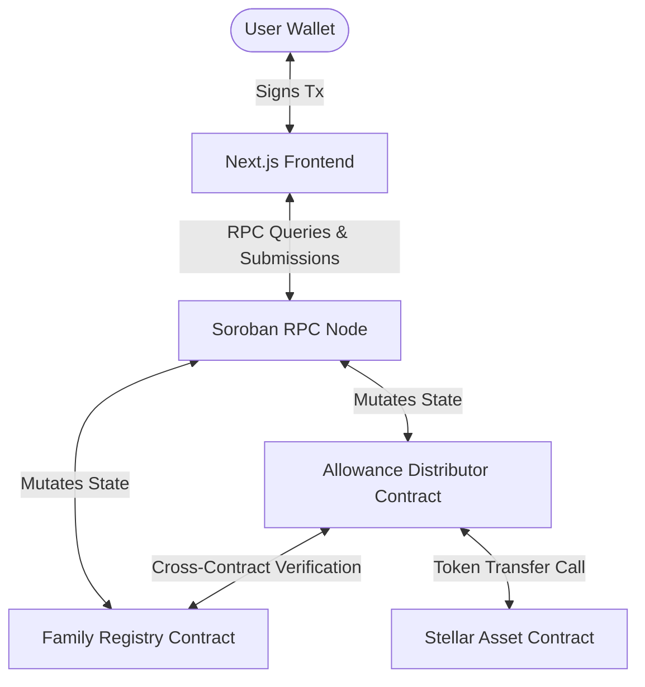
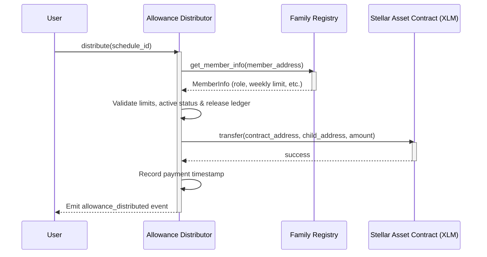
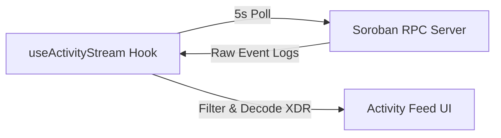

# Technical Architecture — Family Allowance Manager

This document describes the technical architecture, smart contract design, and frontend state flow for the Family Allowance Manager platform.

---

## 🏛️ System Overview

The Family Allowance Manager is a decentralized app built on the Stellar network. It automates recurring allowance payouts, enforces parent/guardian/child roles on-chain, and tracks spending limits using Soroban smart contracts.

---

## 📜 Smart Contract Architecture

The application implements two production-ready Rust contracts:

### 1. Family Registry Contract (`family_registry`)
* **Responsibility**: Manages family group profiles, records membership associations, stores roles (Parent, Guardian, Child), tracks spending limits (stroop amount), and tracks savings goal targets.
* **Storage Strategy**:
  * **Instance Storage**: Stores the global administrator address.
  * **Persistent Storage**: Stores the `FamilyInfo` and `MemberInfo` profiles keyed by address, with automated 1-year TTL extensions on read/write updates.
* **Key Events**: `family_created`, `member_added`, `member_removed`, `limits_updated`, `role_changed`.

### 2. Allowance Distributor Contract (`allowance_distributor`)
* **Responsibility**: Tracks recurring payout schedules, enforces daily/weekly/monthly ledger interval constraints, and executes payments in native XLM to children.
* **Cross-Contract Protocol**:
  * Fetches member roles and weekly spending limits from `family_registry` via a client interface module.
  * Executes XLM token transfers by calling the Stellar Asset Contract (SAC) client interface (`token_contract.transfer()`).
* **Key Events**: `allowance_scheduled`, `allowance_distributed`, `payment_failed`.

---

## 💻 Frontend Architecture

The frontend is a Next.js 15 App Router codebase written in strict TypeScript.

### 1. Reusable Services & State Stores
* **Stellar Service (`stellar.service.ts`)**: Encapsulates all RPC communications, simulation parameters, payload encoding, and raw `pollTransaction` queries.
* **Wallet Store (`wallet.store.ts`)**: Global Zustand state for wallet connections, Freighter wallet binding signatures, Hana, xBull, and Hana client integrations.
* **Transaction Store (`transaction.store.ts`)**: Manages the local transaction center, tracking on-chain transactions across `pending`, `processing`, `confirmed`, and `failed` lifecycles.
* **Settings Store (`settings.store.ts`)**: Manages polling preferences, showing/hiding savings goals, and RPC networks toggles (Testnet, Mainnet, Local).

### 2. Event Streaming Lifecycle
* **useActivityStream Hook**: Initiates every 5 seconds to query the Soroban RPC `getEvents` endpoint with filtering parameters matching both deployed contracts.
* Decodes XDR topics and values to construct human-readable event timelines.

